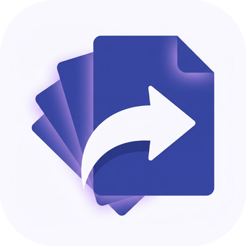
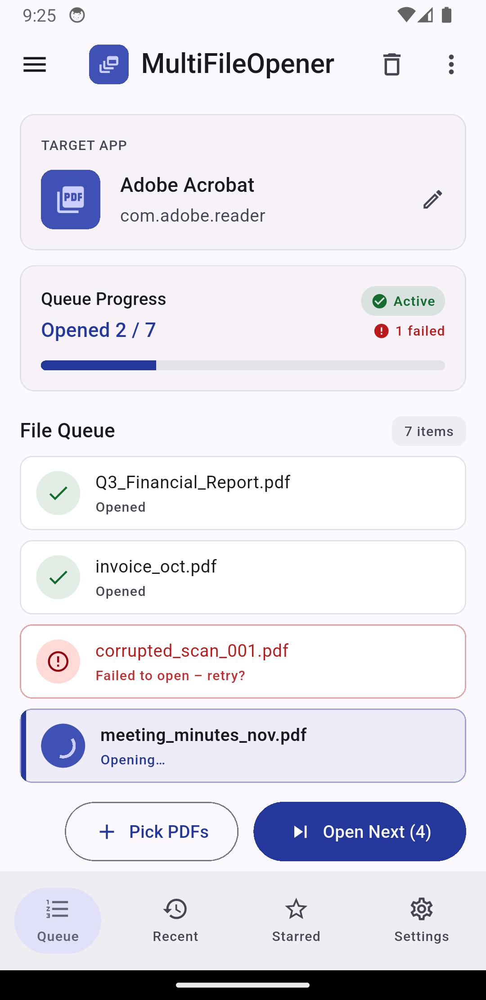
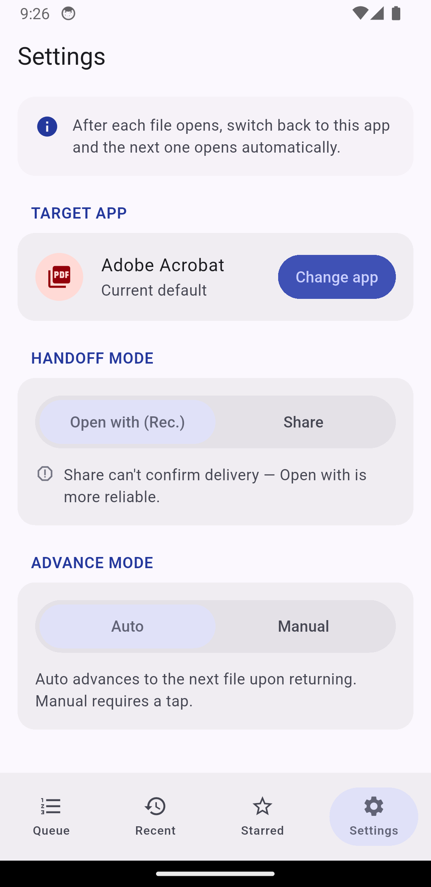
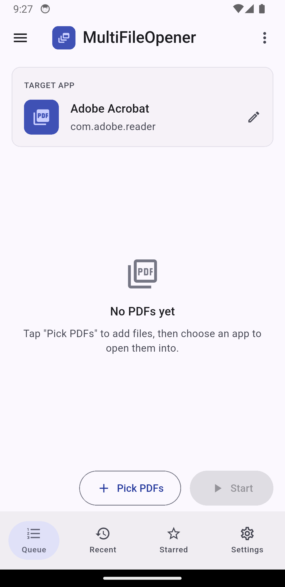

<p align="center">
  
</p>

<h1 align="center">MultiFileOpener</h1>

<p align="center">Hand a whole stack of PDFs to one Android app, one file at a time.</p>

<p align="center">
  
  
  
  
</p>

## Why this exists

Plenty of Android apps only take one PDF at a time. A form filler, a label printer, a signing tool, a niche reader: you hand it a file, it does its thing, and if you have thirty files you get to repeat yourself thirty times. Pick, open, switch back, pick again. It is the kind of small repetitive task that is too boring to do by hand and too fiddly for most automation.

MultiFileOpener sits in front of that app. You pick all the PDFs at once, choose which installed app should receive them, and it feeds them in one after another. You still tap back to it between files (more on why below), but that tap is the only thing you do per file. No re-picking, no hunting through folders again.

## The one limitation, stated plainly

Android does not let an app pull itself back to the foreground after it launches another app. That is an OS rule, not something a clever workaround fixes. So fully hands-free batch opening is not possible on Android, and an app that claims otherwise is either leaning on accessibility-service tricks or stretching the truth.

What is possible is auto-advance on return. The app opens file 1. The moment you switch back, it fires file 2, then file 3, and so on. The app says this out loud in an About note instead of pretending to be magic. If you would rather set the pace yourself, manual mode gives you an "Open Next" button instead.

## Screenshots

<p align="center">
  
  &nbsp;&nbsp;
  
  &nbsp;&nbsp;
  
</p>

<p align="center"><sub>Real captures from the app running on a Pixel 3a, Android 14.</sub></p>

## Features

- Multi-select PDFs in one pass through the system file picker.
- Pick any installed app that can actually open a PDF. The list comes from Android itself, with each app's real icon and name.
- Two handoff modes per session. "Open with" sends an ACTION_VIEW intent so the file opens directly. "Share" sends ACTION_SEND for apps that prefer to receive a file.
- Two advance modes. Auto opens the next file when you return. Manual waits for you to tap "Open Next".
- A queue you can edit: reorder by dragging, remove single files, or clear all of them.
- Live progress. Each file reads pending, opening, opened, or failed, with a running count and a progress bar. A file the target app rejects is marked failed and the queue keeps moving.
- Your target app and both modes are remembered between launches.
- Adapts to screen size. On a tablet the target and progress cards sit side by side and the content stays centered instead of stretching edge to edge.
- A launcher icon and a native splash screen drawn from the project artwork, including the Android 12 splash API and an adaptive icon.

## How it works

Most of the app is Flutter. The two jobs that Flutter plugins tend to get wrong run through a thin Kotlin layer over a single MethodChannel.

Listing apps that can open a PDF uses `PackageManager.queryIntentActivities` against an `application/pdf` view intent. This respects Android 11+ package visibility through a `<queries>` entry in the manifest, which off-the-shelf app-listing plugins often miss.

Opening a file targets one specific package. The Kotlin side wraps the picked file in a `content://` URI through a FileProvider, builds an `ACTION_VIEW` or `ACTION_SEND` intent, calls `setPackage` to pin it to the chosen app, and grants read permission on that URI for that one launch. It returns success or failure, so the queue knows when an app refused a file instead of silently stalling.

The auto-advance decision lives in the controller, not the view. The home screen is a lifecycle observer: when it resumes it tells the controller "we are back," and the controller decides whether to fire the next file based on the mode and where the queue is. A re-entrancy guard keeps a double tap or a fast resume from opening two files at once.

## Zero runtime permissions

The app asks for nothing at runtime. No storage permission, no internet, no media access. Picking PDFs uses the Storage Access Framework, which hands back files the app is already allowed to read. Handing files onward uses FileProvider content URIs with per-launch grants. PDFs are documents, so the Android 13+ `READ_MEDIA_*` permissions do not apply either.

The release manifest carries only the internal `DYNAMIC_RECEIVER_NOT_EXPORTED_PERMISSION` that the framework adds for itself. The icon and splash generators are build-time dev dependencies, so they add nothing to the shipped APK or its permissions.

## Architecture

The Dart code keeps a strict Model, View, Controller split.

```
lib/
  main.dart                         app entry; wires the controller to the view
  src/
    models/                         plain data, no Flutter imports, no I/O
      target_app.dart               an installed app that can receive PDFs
      queue_item.dart               one PDF and its open status
      opener_state.dart             queue, target, modes, current index
    controllers/
      opener_controller.dart        the only home for business logic
    views/                          widgets only; read state, forward events
      home_view.dart                the queue screen
      settings_view.dart            handoff and advance settings
      theme/app_theme.dart          design tokens and breakpoints
      widgets/                      file tile, app picker, segmented controls, nav
    services/                       infrastructure the controller depends on
      native_bridge.dart            MethodChannel wrapper
      prefs_service.dart            shared_preferences load and save
```

Models hold no logic beyond derived getters. Views never touch the services; they observe the controller and call its methods. Every decision about what happens next sits in the controller.

## Build and run

You need the Flutter SDK and an Android device or emulator.

```bash
flutter pub get
flutter run                 # debug, onto a connected device
flutter build apk --release # release APK under build/app/outputs/flutter-apk/
```

Regenerate the launcher icon and splash after changing the source art:

```bash
dart run flutter_launcher_icons
dart run flutter_native_splash:create
```

## Credits

Built with Flutter and Material 3. The UI structure started from a Google Stitch design and was rebuilt natively. Icon and splash come from the project's own artwork in indigo (#3F51B5).
