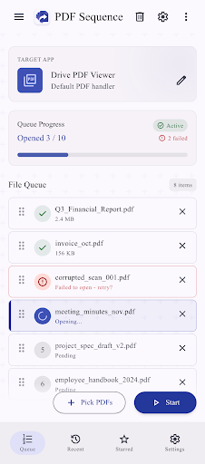
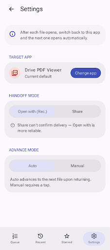
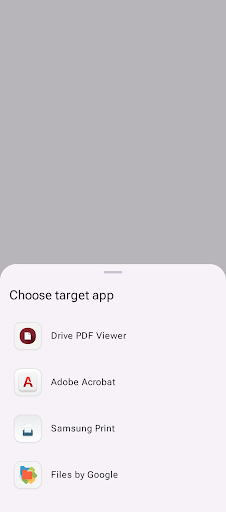

# MultiFileOpener — Stitch UI Design

Generated UI designs for the app, produced in Google **Stitch** from the brief in
[`../../prompts.md`](../../prompts.md). This folder is the local capture of that work
so the designs aren't trapped in the cloud.

## Stitch project

- **Title:** `MultiFile Batch Opener`
- **Resource:** `projects/12007669911692251967`
- **Type:** Text-to-UI Pro · **Device:** Mobile (390 × 884) · **Model:** Gemini 3
- Open it in the Stitch web app (stitch.withgoogle.com) under your projects to edit
  live, generate variants, or export code.

## Design system (matches the app's real theme)

| Token | Value |
|---|---|
| Primary (seed) | **Indigo `#3F51B5`** |
| Primary (resolved) | `#24389c` on `#ffffff` |
| Color system | Material 3, `FIDELITY` tonal, **Light** mode |
| Surface / background | `#fbf8fe` |
| Fonts | **Roboto Flex** (headline / body / label) — native Android feel |
| Corner roundness | `ROUND_EIGHT` (8px; cards 12px, sheets 28px, chips full) |
| Semantics | success = green (completed), error = red (failed / destructive) |

The full design-system markdown lives inside the Stitch project (design-system asset
`assets/e8a236869c264389a855575a9e93d8e5`).

## Screens

Each screen below is saved as both the rendered thumbnail (`.png`) and the generated
source (`.html`).

### 1. Homepage — `screens/7d7619dfde1242a8baa563d8bfc1c912`

Working screen: app-bar (clear-queue + settings), **Target App** card, **Queue Progress**
card ("Opened 3 / 10", *Active* chip, *N failed*, progress bar), and the reorderable
**file queue** with per-row states — green check (opened), red error ("Failed to open –
retry?"), spinner (opening), numbered pending — each with drag handle, file size, remove ✕.
Bottom action row: **Pick PDFs** (outlined) + **Start** (indigo filled).

### 2. Settings — `screens/ead41c6803234ac3b6650280ac4aaee4`

Info banner (auto-advance explanation), **Target App** row + *Change app*, **Handoff mode**
segmented control (*Open with (Rec.)* / Share) with the reliability caption, **Advance mode**
segmented control (*Auto* / Manual) with caption.

### 3. App Picker (bottom sheet) — `screens/4949d16dbc5848468776696e942c4f86`

Modal sheet over a scrim: "Choose target app" + scrollable list of PDF-capable apps with
real icons (Drive PDF Viewer, Adobe Acrobat, Samsung Print, Files by Google).

## Fidelity notes (design vs. the shipped MVC app)

The designs match the brief and the app's real behavior closely. Differences worth a
decision before adopting them as the spec:

1. **Invented bottom nav.** The Homepage adds a `Queue / Recent / Starred / Settings`
   tab bar. The real app has **no Recent or Starred** features and reaches Settings via the
   app-bar gear. Either drop the tab bar (strict fidelity) or treat Recent/Starred as a
   future roadmap idea.
2. **App name.** The Homepage render is titled **"PDF Sequence"**; the app is
   `MultiFileOpener` (project name "MultiFile Batch Opener"). Pick one name and align.
3. **Redundant Settings entry** — gear in the app-bar *and* a Settings tab; keep one.

These are easy one-line `edit_screens` refinements in Stitch when you've decided.

## Implemented in the app

These three designs are now built natively in the Flutter app (View layer only —
the Model/Controller and all batch-open behavior are unchanged):

- **Design system** → `lib/src/views/theme/app_theme.dart` (the Stitch tokens
  above ported 1:1 into a Material 3 `ColorScheme`).
- **Homepage** → `lib/src/views/home_view.dart` + `widgets/file_tile.dart` +
  `widgets/app_bottom_nav.dart` (bento Target/Progress cards, per-state queue
  rows, right-aligned pill action row, 4-tab bottom nav).
- **Settings** → `lib/src/views/settings_view.dart` +
  `widgets/handoff_advance_bar.dart` + `widgets/pill_segmented.dart`.
- **App picker** → `lib/src/views/widgets/app_picker_sheet.dart`.

How the fidelity notes above were resolved in the build:

1. **Bottom nav (Recent/Starred)** — kept to match the design; they surface a
   "not available yet" snackbar since they have no backing feature.
2. **App name** — the app uses the real name **MultiFileOpener** (not the
   render's "PDF Sequence").
3. **Redundant Settings entry** — kept both (app-bar gear + Settings tab) to
   match the design; both navigate to the Settings screen. The app-bar's
   `menu` opens a working Drawer and `more_vert` an About dialog.

A multi-agent fidelity audit (per-screen design diff + MVC-contract + runtime
correctness, each finding adversarially verified) was run against the build;
all 16 confirmed pixel/spacing/token gaps were fixed. `flutter analyze` is clean.
